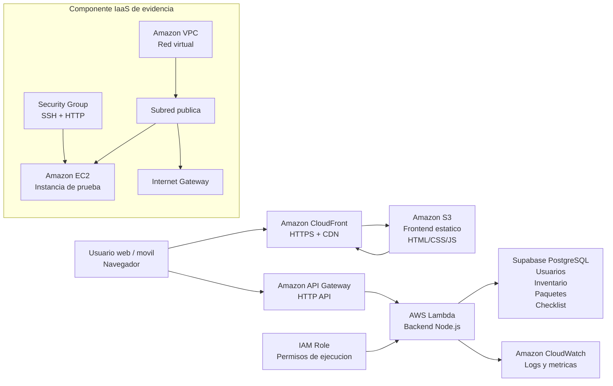

# FotoStock

FotoStock es una aplicacion web para administrar inventario de material fotografico, preparar paquetes para producciones y validar checklist de salida/regreso. El proyecto fue desarrollado como entrega de Cloud Computing y despliega una solucion funcional combinando frontend estatico, backend serverless, persistencia, redes, seguridad, observabilidad y estimacion de costos.

## Demo

- Aplicacion HTTPS: `https://dyba4pp9u9eet.cloudfront.net`
- Frontend S3 directo: `http://fotostock-frontend-954377119221.s3-website-us-east-1.amazonaws.com`

La URL recomendada para usuarios finales es CloudFront, porque entrega el sitio por HTTPS.

## Funcionalidades

- Registro e inicio de sesion con cedula y contrasena.
- Autenticacion con JWT emitido por el backend.
- Inventario privado por usuario.
- Creacion, edicion y eliminacion de material fotografico.
- Categorias: camaras, lentes, flashes, tripodes, filtros, triggers, memorias y gadgets.
- Paquetes de produccion con seleccion de material.
- Checklist independiente para salida y regreso.
- Interfaz oscura responsive para escritorio y mobile.

## Arquitectura



## Servicios Usados

- **Amazon S3**: hospeda los archivos estaticos del frontend.
- **Amazon CloudFront**: distribuye el frontend por HTTPS y cache en edge locations.
- **Amazon API Gateway**: expone la API HTTP consumida por el navegador.
- **AWS Lambda**: ejecuta el backend serverless en Node.js.
- **Supabase PostgreSQL**: persiste usuarios, inventario, paquetes y checklist.
- **Amazon CloudWatch**: registra logs y metricas basicas de Lambda.
- **Amazon EC2, VPC, Subnet, Internet Gateway y Security Group**: evidencian el componente IaaS, redes y seguridad basica.
- **IAM Role**: otorga permisos de ejecucion a Lambda siguiendo el principio de menor privilegio para logs.

## Flujo de Datos

1. El usuario accede a la aplicacion mediante CloudFront.
2. CloudFront entrega los archivos estaticos almacenados en S3.
3. El navegador consume la API publicada en API Gateway.
4. API Gateway invoca la funcion Lambda.
5. Lambda valida el JWT, procesa la solicitud y consulta Supabase.
6. Supabase devuelve los datos persistidos.
7. Lambda responde al frontend y registra eventos en CloudWatch.

## Estructura Del Proyecto

```text
.
|-- index.html
|-- styles.css
|-- app.js
|-- config.js
|-- cloudfront-distribution.json
|-- backend/
|   |-- lambda.mjs
|   |-- local-server.mjs
|   |-- package.json
|   |-- deploy-lambda.ps1
|   `-- serverless.yml
`-- database/
    |-- schema.sql
    `-- migrations/
```

## Configuracion Local

1. Crea un proyecto en Supabase.
2. En Supabase SQL Editor ejecuta `database/schema.sql`.
3. Crea `backend/.env.local` con estas variables. Este archivo es secreto y no se sube a GitHub:

```env
SUPABASE_URL=https://TU-PROYECTO.supabase.co
SUPABASE_SERVICE_ROLE_KEY=TU_SERVICE_ROLE_KEY
JWT_SECRET=una-clave-larga-y-secreta
CORS_ORIGIN=*
PORT=8787
```

En `SUPABASE_SERVICE_ROLE_KEY` debes usar una key privada de servidor: `service_role` o `secret`. No uses `anon` ni `publishable`, porque esas claves no deben operar como backend.

4. Arranca la API local:

```powershell
cd backend
node local-server.mjs
```

5. Para pruebas locales, cambia temporalmente `config.js` a:

```js
window.FOTOSTOCK_CONFIG = {
  API_BASE_URL: "http://localhost:8787",
};
```

6. Abre `index.html` en el navegador.

## Despliegue

- El frontend se sube a S3 y se distribuye por CloudFront.
- El backend se despliega como Lambda con `backend/deploy-lambda.ps1`.
- API Gateway expone la funcion Lambda como API HTTP.
- Supabase se configura ejecutando el SQL de `database/schema.sql` y las migraciones.
- EC2/VPC/Subred publica/IGW/Route Table/Security Group se crean como evidencia IaaS.

## Seguridad

- La clave privada de Supabase solo vive en Lambda o en `backend/.env.local`.
- El frontend nunca contiene `SUPABASE_SERVICE_ROLE_KEY`.
- Los usuarios se autentican con cedula y contrasena.
- El backend emite JWT y valida cada solicitud protegida.
- El inventario y los paquetes se filtran por usuario autenticado.
- Los archivos sensibles estan excluidos con `.gitignore`.

## Observabilidad Y Costos

- CloudWatch registra invocaciones, errores controlados y metricas basicas de Lambda.
- La estimacion en AWS Pricing Calculator dio un costo aproximado de `0.20 USD/mes`, usando bajo trafico academico y EC2 solo como evidencia/pruebas.

## Evidencias Recomendadas Para La Entrega

- S3 con archivos del frontend.
- CloudFront con estado desplegado.
- API Gateway conectado a Lambda.
- Lambda y variables de entorno configuradas.
- CloudWatch Logs con requests.
- Supabase con tablas y datos.
- EC2 en VPC personalizada.
- Subred publica, Internet Gateway, Route Table y Security Group.
- AWS Pricing Calculator.
- App funcionando: login, inventario, paquetes y checklist.

## Archivos Que No Se Suben

- `backend/.env.local`: contiene secretos.
- `*.pem`: llaves privadas de EC2.
- `*.zip`: paquetes generados para Lambda.
- `*.log`: logs locales.
- `lambda-trust-policy.json` y `s3-policy.json`: archivos temporales generados durante despliegue.

## Licencia

Este proyecto se publica para revision academica y desarrollo personal. Todos los derechos estan reservados; no se concede permiso para copiar, redistribuir o reutilizar el codigo sin autorizacion.
