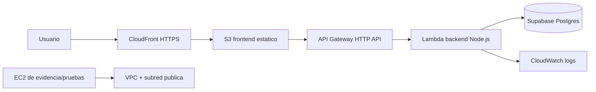

# FotoStock - Inventario de material fotografico

Aplicacion web para administrar inventario fotografico, preparar paquetes de material para producciones y validar checklist de salida/regreso.

## Que incluye ahora

- Frontend estatico listo para S3.
- Login con cedula y contrasena.
- Creacion de cuenta guardada en Supabase.
- JWT real emitido por el backend.
- Backend serverless compatible con AWS Lambda + API Gateway.
- CRUD de inventario contra Supabase.
- Paquetes de produccion con seleccion de material.
- Checklist independiente para salida y regreso.
- SQL de base de datos en `database/schema.sql`.

## URL desplegada

- Frontend S3: `http://fotostock-frontend-954377119221.s3-website-us-east-1.amazonaws.com`
- Frontend CloudFront HTTPS: `https://dyba4pp9u9eet.cloudfront.net`
- API Gateway: `https://dq70ye7x25.execute-api.us-east-1.amazonaws.com`

## Arquitectura del proyecto



## Que significa cada servicio

- **S3**: aloja `index.html`, `styles.css`, `app.js` y `config.js`.
- **CloudFront**: entrega el frontend por HTTPS y cache en edge locations.
- **Lambda**: es el backend real. Valida login, crea cuentas, genera JWT y guarda/lee datos.
- **Supabase**: base de datos Postgres donde viven usuarios, inventario, paquetes y checks.
- **API Gateway**: publica la Lambda como API HTTP para que el frontend pueda consumirla.
- **EC2/VPC**: cumple la parte IaaS del proyecto. Puede ser una instancia pequena para pruebas, evidencia de red y captura de configuracion; no tiene que alojar la app si usamos S3 + Lambda.
- **CloudWatch**: guarda logs y metricas de Lambda/API.

## Infraestructura creada

- VPC: `vpc-09d00532d350c3d62`
- Subred publica: `subnet-0f8dea12c6a583220`
- Internet Gateway: `igw-0511d5af8677e5187`
- Route table publica: `rtb-0c31c6e73388d2539`
- Security Group EC2: `sg-026171a5548ca7acb`
- EC2: `i-02be7044d66d81254`
- CloudFront: `E1KBW0LU5KVXYW`
- Lambda: `arn:aws:lambda:us-east-1:954377119221:function:fotostock-api`
- CloudWatch log group: `/aws/lambda/fotostock-api`

## Estructura

```text
.
|-- index.html
|-- styles.css
|-- app.js
|-- config.js
|-- backend/
|   |-- lambda.mjs
|   |-- local-server.mjs
|   |-- package.json
|   |-- deploy-lambda.ps1
|   `-- serverless.yml
`-- database/
    |-- schema.sql
    `-- migrations/
```

## Configuracion local

1. Crea un proyecto en Supabase.
2. En Supabase SQL Editor ejecuta `database/schema.sql`.
3. Crea `backend/.env.local` con estas variables. Este archivo es secreto y no se sube a GitHub:

```env
SUPABASE_URL=https://TU-PROYECTO.supabase.co
SUPABASE_SERVICE_ROLE_KEY=TU_SERVICE_ROLE_KEY
JWT_SECRET=una-clave-larga-y-secreta
CORS_ORIGIN=*
PORT=8787
```

En `SUPABASE_SERVICE_ROLE_KEY` debes poner una key privada de servidor: `service_role` o `secret`. No uses `anon` ni `publishable`, porque esas claves respetan RLS y no pueden insertar en `inventory_items` desde este backend.

4. Arranca la API local:

```powershell
cd backend
node local-server.mjs
```

Deja esa terminal abierta mientras pruebas la aplicacion. Si la cierras, el frontend mostrara un error de conexion.

5. Para pruebas locales, cambia temporalmente `config.js` a `http://localhost:8787` y abre `index.html`.

## Despliegue

1. Subir el frontend a S3 como static website.
2. Desplegar `backend/lambda.mjs` con `backend/deploy-lambda.ps1`.
3. Mantener `config.js` apuntando a la URL de API Gateway.
4. Crear VPC, subred publica y EC2 pequena para cumplir el modulo IaaS.
5. Activar CloudWatch logs, revisar metricas y tomar capturas para el documento tecnico.

## Nota de seguridad

La `SUPABASE_SERVICE_ROLE_KEY` solo debe vivir en Lambda o en tu entorno local de backend. Nunca debe ponerse en `config.js`, HTML ni frontend.

## Licencia

Este proyecto se publica para revision academica y desarrollo personal. Todos los derechos estan reservados; no se concede permiso para copiar, redistribuir o reutilizar el codigo sin autorizacion.

## Archivos que no se suben

- `backend/.env.local`: contiene secretos.
- `*.pem`: llaves privadas de EC2.
- `*.zip`: paquetes generados para Lambda.
- `*.log`: logs locales.
- `lambda-trust-policy.json` y `s3-policy.json`: archivos temporales generados durante despliegue.
