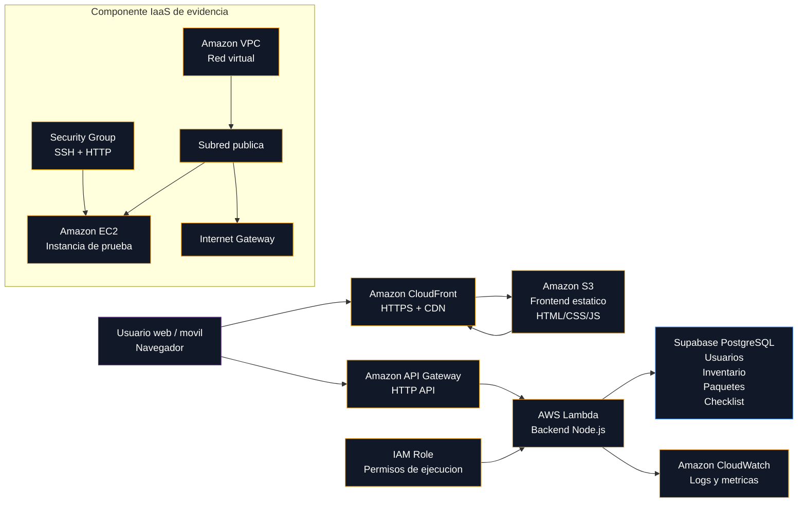

# Documento Tecnico - FotoStock

## 1. Descripcion General

FotoStock es una aplicacion web para administrar inventario de material fotografico, preparar paquetes para producciones y validar checklist de salida y regreso. La solucion permite que cada usuario cree su cuenta, inicie sesion, gestione su propio inventario y arme paquetes de materiales para una sesion fotografica.

El proyecto fue desarrollado como una solucion cloud funcional, combinando frontend estatico, backend serverless, persistencia de datos, infraestructura IaaS de evidencia, seguridad, observabilidad y estimacion de costos.

## 2. Objetivo Del Proyecto

El objetivo es demostrar el uso integrado de servicios cloud para construir, desplegar y documentar una aplicacion web funcional. La solucion cubre los componentes solicitados en el proyecto:

- Frontend hospedado en almacenamiento cloud.
- Backend serverless conectado a eventos HTTP.
- Base de datos para persistencia real.
- Componente IaaS con red, subred publica y seguridad.
- Monitoreo mediante logs y metricas.
- Estimacion de costos.
- Repositorio con frontend, backend, base de datos, configuraciones y documentacion.

## 3. URLs Del Proyecto

- Aplicacion HTTPS: `https://dyba4pp9u9eet.cloudfront.net`
- Frontend S3 directo: `http://fotostock-frontend-954377119221.s3-website-us-east-1.amazonaws.com`
- API Gateway: `https://dq70ye7x25.execute-api.us-east-1.amazonaws.com`
- Repositorio GitHub: `https://github.com/Quirama1108/FotoStock`

La URL recomendada para usuarios finales es CloudFront, porque entrega el sitio mediante HTTPS.

## 4. Arquitectura



## 5. Flujo De Datos

1. El usuario ingresa a la aplicacion usando la URL HTTPS de CloudFront.
2. CloudFront entrega el frontend estatico almacenado en Amazon S3.
3. El navegador carga `index.html`, `styles.css`, `app.js` y `config.js`.
4. El frontend consume la API publicada en API Gateway.
5. API Gateway invoca la funcion Lambda.
6. Lambda valida el JWT y determina el usuario autenticado.
7. Lambda consulta o modifica los datos en Supabase PostgreSQL.
8. Supabase retorna la informacion solicitada.
9. Lambda responde al frontend.
10. CloudWatch registra logs y metricas de la ejecucion.

## 6. Servicios Utilizados Y Justificacion

### Amazon S3

S3 se utilizo para hospedar el frontend estatico. Es adecuado porque la aplicacion cliente esta compuesta por HTML, CSS y JavaScript, sin necesidad de un servidor tradicional para renderizar paginas.

Evidencias:


### Amazon CloudFront

CloudFront se agrego delante de S3 para entregar la aplicacion mediante HTTPS, mejorar el rendimiento y facilitar el acceso desde navegadores moviles. Tambien aporta cache en edge locations y proteccion basica mediante AWS Shield Standard.

Evidencia:


### Amazon API Gateway

API Gateway expone el backend como una API HTTP publica. El frontend lo consume para registrar usuarios, iniciar sesion, administrar inventario y gestionar paquetes/checklists.

Tambien se configuro throttling para controlar abuso de peticiones y reducir el riesgo de costos inesperados:

- Rate limit: 10 solicitudes por segundo.
- Burst limit: 20 solicitudes.

Evidencia:


### AWS Lambda

Lambda ejecuta el backend serverless en Node.js. La funcion recibe las solicitudes desde API Gateway, valida autenticacion, procesa la logica de negocio y consulta Supabase.

Evidencias:


### Supabase PostgreSQL

Supabase se uso como base de datos PostgreSQL administrada. Permite persistir usuarios, inventario, paquetes y checklist. Aunque no es un servicio AWS, cumple el requisito de base de datos o almacenamiento persistente equivalente para la aplicacion.

Tablas principales:

- `app_users`
- `inventory_items`
- `production_packages`
- `package_items`
- `package_checks`

Evidencias:


### Amazon CloudWatch

CloudWatch registra logs y metricas basicas de la funcion Lambda. Se agregaron logs de solicitud y error para poder verificar invocaciones, rutas, estados y fallos controlados.

Evidencias:


### Amazon EC2, VPC Y Red

Para cumplir el componente IaaS se creo una instancia EC2 dentro de una VPC personalizada, con subred publica, Internet Gateway, tabla de rutas y Security Group.

La aplicacion principal no se aloja en EC2, porque se eligio una arquitectura serverless mas economica y adecuada para el caso de uso. EC2 se usa como evidencia de configuracion IaaS, redes y seguridad basica.

Evidencias:


## 7. Funcionamiento De La Aplicacion

La aplicacion permite:

- Crear cuenta de usuario.
- Iniciar sesion con cedula y contrasena.
- Mantener inventario privado por usuario.
- Crear, editar y eliminar material fotografico.
- Clasificar material por categorias.
- Crear paquetes de produccion.
- Agregar material disponible a un paquete.
- Marcar checklist de salida.
- Marcar checklist de regreso.

Evidencias:


## 8. Seguridad

La solucion aplica buenas practicas basicas de seguridad:

- Autenticacion con cedula y contrasena.
- Emision y validacion de JWT desde el backend.
- Inventario, paquetes y checklist filtrados por usuario autenticado.
- La clave privada de Supabase solo vive en Lambda o en `backend/.env.local`.
- El frontend no contiene `SUPABASE_SERVICE_ROLE_KEY`.
- `.gitignore` evita subir secretos, llaves `.pem`, paquetes `.zip`, logs y archivos locales sensibles.
- Security Group de EC2 con reglas controladas.
- API Gateway throttling para reducir abuso de peticiones.
- CloudFront entrega el frontend por HTTPS.
- AWS Shield Standard protege CloudFront frente a ataques DDoS comunes sin costo adicional.

Se intento configurar reserved concurrency en Lambda para limitar ejecuciones simultaneas, pero la cuenta no permitio reservar concurrencia debido al minimo requerido de concurrencia no reservada. Por esto, el control principal de abuso se implemento en API Gateway.

## 9. Observabilidad

La observabilidad se implemento mediante CloudWatch:

- Log group: `/aws/lambda/fotostock-api`
- Registro de invocaciones Lambda.
- Registro de errores controlados.
- Metricas de invocaciones, duracion y errores desde Lambda Monitor.

Ejemplo de log registrado:

```text
request {"method":"GET","path":"/me"}
request_error {"method":"GET","path":"/me","status":401,"message":"Sesion requerida."}
```

## 10. Estimacion De Costos

Se realizo una estimacion en AWS Pricing Calculator con uso academico de bajo trafico:

- S3 para frontend estatico.
- CloudFront para HTTPS/CDN.
- Lambda para backend serverless.
- API Gateway para peticiones HTTP.
- EC2 t3.micro usada como evidencia/pruebas.
- CloudWatch Logs y metricas.

Resultado estimado:

- Costo inicial: 0.00 USD.
- Costo mensual: 0.20 USD.
- Costo anual aproximado: 2.40 USD.

Evidencia:


## 11. Cumplimiento Del Proyecto

| Requisito | Implementacion | Evidencia |
| --- | --- | --- |
| Frontend en la nube | S3 + CloudFront | `04`, `05`, `06` |
| Backend serverless | API Gateway + Lambda Node.js | `07`, `08`, `09` |
| Persistencia | Supabase PostgreSQL | `12`, `13` |
| IaaS | VPC, subred publica, EC2, IGW, Security Group | `14`, `16`, `17`, `18`, `19` |
| Seguridad | JWT, scoping por usuario, secretos fuera del frontend, throttling | Codigo, API Gateway, Security Group |
| Observabilidad | CloudWatch Logs y metricas Lambda | `10`, `11` |
| Costos | AWS Pricing Calculator | `20` |
| Repositorio | GitHub con codigo y documentacion | `21` |

## 12. Repositorio

El proyecto fue subido a GitHub e incluye:

- Codigo frontend.
- Codigo backend.
- Script de despliegue Lambda.
- Configuracion CloudFront.
- SQL de base de datos.
- Migraciones.
- README.
- Licencia restrictiva.

Evidencia:


## 13. Estructura Del Proyecto

```text
.
|-- index.html
|-- styles.css
|-- app.js
|-- config.js
|-- cloudfront-distribution.json
|-- backend/
|   |-- lambda.mjs
|   |-- local-server.mjs
|   |-- package.json
|   |-- deploy-lambda.ps1
|   `-- serverless.yml
|-- database/
|   |-- schema.sql
|   `-- migrations/
|-- docs/
|   `-- documento-tecnico.md
`-- evidencias/
```

## 14. Conclusiones Y Aprendizajes

El proyecto demuestra como integrar distintos servicios cloud en una solucion funcional. La arquitectura separa responsabilidades: S3 y CloudFront entregan el frontend, API Gateway y Lambda procesan la logica serverless, Supabase persiste datos, CloudWatch permite observabilidad y EC2/VPC evidencian infraestructura IaaS.

Uno de los aprendizajes principales fue diferenciar entre una aplicacion alojada en una instancia tradicional y una solucion serverless. Aunque EC2 se creo para cumplir el componente IaaS, la aplicacion principal se beneficio de una arquitectura mas liviana y economica basada en S3, CloudFront, API Gateway y Lambda.

Tambien fue importante aplicar seguridad por capas: autenticacion con JWT, separacion de datos por usuario, proteccion de secretos, throttling en API Gateway y uso de HTTPS mediante CloudFront.

Finalmente, la estimacion de costos evidencio que una aplicacion de bajo trafico puede operar con costos muy reducidos si se usan servicios serverless y recursos ajustados al uso real.
